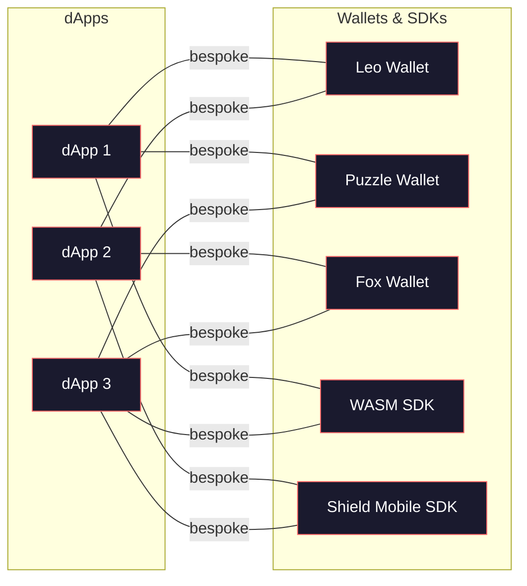
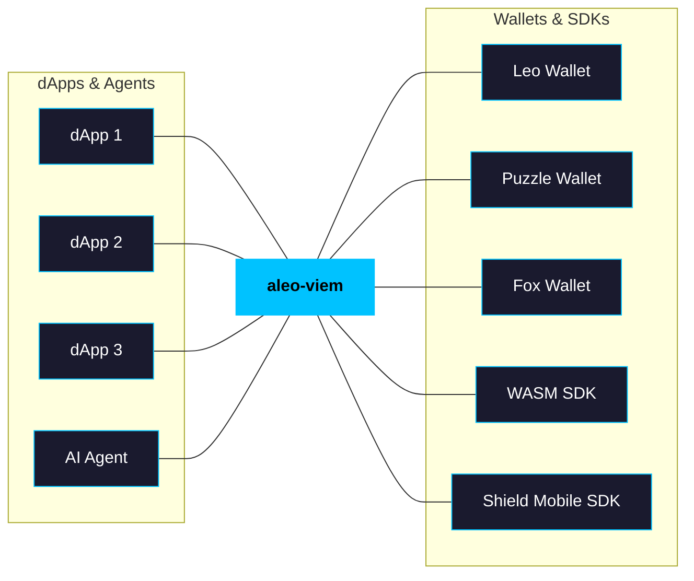
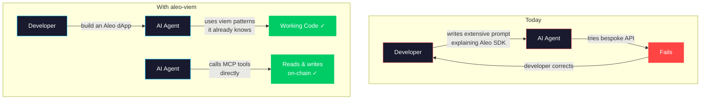

# aleo-viem: A Unified Developer Interface for Aleo

## The Problem

Aleo's developer ecosystem is fragmented. Every surface — the WASM SDK, Shield Mobile SDK, Leo Wallet, Puzzle Wallet, Fox Wallet — has its own bespoke API, its own patterns, and its own mental model. A developer who learns one doesn't know the other. There is no shared language across the ecosystem.

This isn't just inconvenient. It's a structural barrier to adoption — and the results are visible.
* Mainnet has under 1000 deployed programs
* Few active developers are building applications
* Partners struggle to integrate.
* Very little chain volume. The token's slide to > $0.10 reflects this: markets price ecosystems on usage and adoption, not just capability.

Meanwhile, AI agents are becoming the primary way software gets built — and they can't build on Aleo either. Agents trained on Ethereum's standardized tooling hit a wall when they encounter Aleo's fragmented, bespoke APIs. In a world where "easy for agents to build on" increasingly means "easy to build on, period," this is a compounding disadvantage.

### Developers aren't coming from zero — they're coming from Ethereum

The vast majority of dApp developers today work on EVM chains or Solana. They think in terms of `getBalance`, `sendTransaction`, `readContract`. They've built with viem, ethers.js, or web3.js. When they evaluate Aleo, they encounter:

- Programs instead of contracts
- Records + Mappings instead of balances
- Proving instead of signing

Every one of these concepts has an analogue they already understand — but the existing tooling presents them as entirely foreign. The result: developers who would build on Aleo bounce off the onboarding curve before they ship anything.

### The cost of fragmentation is compounding

Today, each new wallet or SDK that enters the Aleo ecosystem must invent its own integration path. There is no standard developer-facing interface for them to implement. This means:

- **Wallet developers** build adapters that only work with their wallet
- **dApp developers** write integration code per wallet, per SDK, per platform
- **New entrants** have no clear path to plug into the ecosystem — they must study each existing tool individually

Every new participant multiplies the integration surface instead of reducing it.


*Today: every integration is bespoke. Every new participant multiplies the surface.*

## The Solution

**aleo-viem** is a TypeScript interface library that wraps Aleo's existing wallets and SDKs behind a unified, viem-compatible API — for both human developers and AI agents.

It does not replace any existing tool. It sits above them, providing a single interface that any wallet, SDK, or service can implement. Developers write their dApp once, against the aleo-viem interface, and it works with every wallet and SDK that plugs in. Agents call the same interface through MCP tools and structured agent tool schemas, shipped incrementally with every feature.


*With aleo-viem: write once, works everywhere. Every new participant plugs in.*

<details>
<summary>Code example: reading and writing on Aleo</summary>

```ts
import { createPublicClient, createWalletClient, http, custom, rpcAccount } from '@aleo-viem/core'

// Read from the chain — same patterns as viem on Ethereum
const publicClient = createPublicClient({
  transport: http('https://api.provable.com/v2'),
})
const balance = await publicClient.getBalance({ address: 'aleo1...' })

// Execute a program transition through a wallet
const walletClient = createWalletClient({
  account: rpcAccount(walletAdapter),
  transport: custom(walletAdapter),
})
await walletClient.writeContract({
  program: 'token.aleo',
  function: 'transfer',
  inputs: ['aleo1...', '100u64'],
  fee: 1000n,
})
```

</details>

A developer who has used viem on Ethereum can read this immediately. An agent trained on viem can write it. The learning curve is the delta between Ethereum and Aleo's unique concepts — not the delta between zero and an entirely unfamiliar SDK.

### Put Aleo where Web3 usage is

aleo-viem is the foundation of a broader developer ecosystem strategy. Each layer expands where Aleo is accessible:

1. **Skills & example dApps** — pre-built templates and example applications (in the vein of [Aleo Skills](https://github.com/ProvableHQ/aleo-skills)) built on aleo-viem. Developers vibe code immediately. Agents build dApps out of the box.
2. **Agent tools & MCP server** — agent tool schemas and an MCP server give any agent framework direct Aleo access. Works with LangChain, Vercel AI SDK, and any tool-calling system.
3. **Agentic ecosystem integrations** — plug into 3rd-party agent platforms where agents already operate: Coinbase AgentKit, MPC Protocol, Near intent swap agents. Developers use agents in any surface.
4. **3rd-party wallet integrations** — integrate into wallets where users already are, bringing Aleo's privacy use-cases to established platforms.

## Why This Matters for AI-Driven Development

### Agents already know viem

The most capable coding agents — Claude, GPT-4, Codex — have been trained extensively on Ethereum development tooling. They know how to use viem. They know `createPublicClient`, `createWalletClient`, `readContract`, `writeContract`. This isn't a minor advantage. It means:

- **An agent asked to "build an Aleo dApp" can start immediately** using patterns it already knows, rather than requiring extensive context about bespoke Aleo APIs
- **The prompt engineering burden on developers drops dramatically** — instead of explaining Aleo's SDK conventions in every prompt, they write natural instructions like "read the balance" or "execute a transfer"
- **Agent-built code is more reliable** because the agent is working with a well-known interface rather than improvising against unfamiliar documentation

### Without it, every agent interaction starts from scratch



Today, asking an AI agent to build on Aleo requires:

1. Providing extensive documentation about whichever SDK you're using
2. Explaining Aleo-specific concepts and how they map to what the agent knows
3. Correcting the agent repeatedly as it tries to apply Ethereum patterns to Aleo's bespoke APIs
4. Repeating this for every new wallet or SDK surface

This friction compounds. It makes Aleo harder to build on with AI assistance than chains with standardized tooling. In a world where AI-driven development is becoming the primary way software gets built, **being hard for agents to work with is being hard to build on, period.**

### Agent tooling is built in, not bolted on

aleo-viem doesn't just provide a library and hope agents figure it out. Agent tooling is a first-class output of every development phase:

- **MCP server** — exposes every aleo-viem action as a tool that AI agents can call directly. An agent can read balances, execute transitions, deploy programs, and wait for confirmations without writing any code. Shipped incrementally: when a new action lands in the library, its MCP tool ships in the same commit.
- **Agent tool schemas** — framework-agnostic tool definitions with rich descriptions that explain Aleo concepts via Ethereum analogies. Plug directly into LangChain, Vercel AI SDK, or any tool-calling system.
- **Structured JSON output** — all values returned as parsed structured data, not Aleo's native string encoding. Agents parse `{ value: 100, type: "u64" }` instead of `"100u64"`.
- **Program introspection** — agents can ask "what can this program do?" and get back a structured description of functions and mappings, before they call anything.
- **Actionable errors** — every error message is an instruction an agent can act on, not a stack trace.

Without a unified interface, every MCP server would need to be built against a specific SDK, fragmenting the agent ecosystem the same way the developer ecosystem is fragmented today. aleo-viem solves this once.

## What We Lose Without It

- **No adoption** — developers never adopt, no dApps get built, no chain activity
- **Integrations remain painful** — difficult, costly, and fail to be maintained
- **We lose the AI game** — every agent integration is bespoke (bespoke MCP servers, CLIs) and flakey
- **Churn** — maintenance of bespoke integration code is difficult, developers leave

## The Time Is Now

Developers are already arriving. Monthly downloads of `@provablehq/sdk` have grown 12x in the past year — from ~800/month to ~9,400/month — and accelerating. But right now, every one of those developers hits fragmented, bespoke APIs with no shared standard.

The window to establish a standard interface is while adoption is growing, not after it stalls. Give developers a standard before they leave.

## Q2 Scope

Three packages ship in Q2. Core has zero hard dependencies. Adapter packages bridge to the ecosystem.

**`@aleo-viem/core`** — zero hard dependencies
- Clients, transports, accounts, all public and wallet actions
- `getContract` + `parseProgram` for typed contract instances
- Agent tool schemas, MCP server, structured JSON output
- 2-3 example skills and dApps

**`@aleo-viem/wallet-adapter`** — wraps `@provablehq/aleo-wallet-standard`
- `rpcAccount()` and `custom()` transport for any Aleo wallet
- Required for dApp wallet connection

**`@aleo-viem/provable`** — wraps `@provablehq/sdk`
- `privateKeyToAccount()` with key derivation, local signing, proving
- Required for local account usage

## Measuring Success

### Q2: Proving the core promises

Success in Q2 is demonstrated, not measured. Three promises, each proven with live demonstrations:

| Promise | Demonstration |
|---|---|
| **Ease of use** | `npm install` to reading chain state in under 5 minutes. A viem developer builds a working Aleo dApp without Aleo-specific docs. |
| **Write once** | Same dApp code works across Leo Wallet, Puzzle Wallet, and Provable SDK — swap the adapter import, everything else is identical. |
| **Agent accessible** | An agent builds a working dApp on first try from a simple prompt. MCP tools work with zero config — balance checks, transfers, program execution all succeed. |

### Q3: Measuring adoption

| Metric | What we measure |
|---|---|
| **npm weekly downloads** | Weekly installs per package, week-over-week growth, unique consuming packages |
| **Programs deployed & used** | New programs on mainnet, programs with active weekly transactions, unique interacting addresses |
| **Agent tool calls** | MCP server installs and active connections, total tool invocations per month, agent success rate |
| **3rd-party integrations** | Number of integrations shipped, downstream usage per integration, community-contributed adapters |

## The Ask

Fund the development of `@aleo-viem/core`, `@aleo-viem/wallet-adapter`, and `@aleo-viem/provable` as the standard developer interface for Aleo. Position it as the recommended way to build dApps on Aleo, the foundation for AI agent tooling, and the integration target for new wallets entering the ecosystem.

The alternative is continuing to ask every developer, every agent, and every new wallet to solve the same fragmentation problems independently — a cost that grows with every participant we add to the ecosystem.
